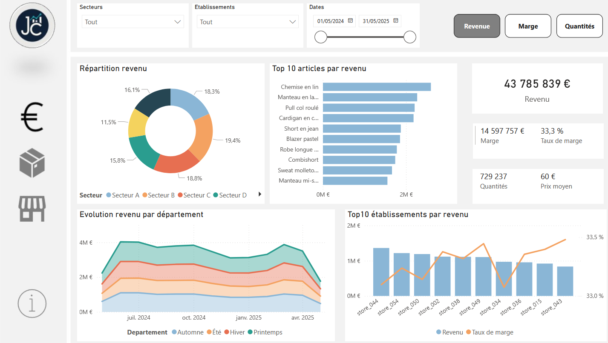
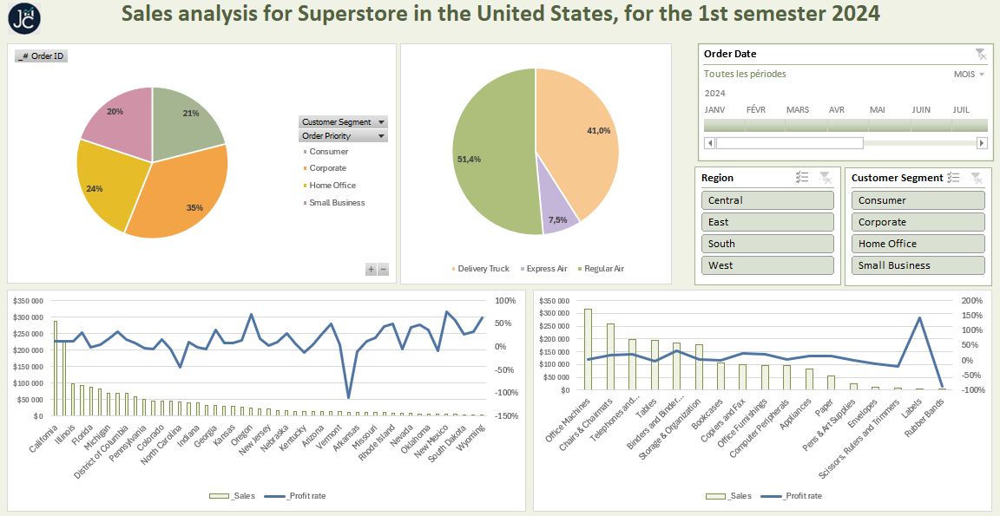

# Data Analyst

Data & Business Intelligence au service de la performance métier

Professionnel de la donnée avec une approche à la fois stratégique et opérationnelle, je conçois et pilote des projets data au service de la performance métier. Depuis plusieurs années chez Cyclable, je structure l’écosystème data d’un réseau de 80 magasins : Mon rôle couvre l’ensemble de la chaîne de valeur data : architecture, qualité, pilotage de projets BI, analyse métier et accompagnement des équipes terrain.

Je conçois des outils décisionnels sur-mesure (Power BI), fiabilise les flux de données et développe une culture data opérationnelle au sein des équipes, du siège aux magasins. Mes interventions visent à rendre la donnée claire, utile et activable, au plus proche des besoins métiers.

🛠 Compétences clés : Power BI, DAX, Power Query, SQL, Excel, Azure Data Factory, modélisation de données, data governance, conduite du changement

## Work Experience

### Data Manager & Data Analyst @ ADC Cyclable (2020 - )
Je pilote les projets data au sein d’un réseau d'environ 80 magasins de vélos. Mon rôle s’articule autour de la structuration des données, de la mise en œuvre de la BI, et de l’adoption des outils data par les équipes terrain.

🔹 Architecture & gouvernance des données
- Participation à la modélisation du modèle de données et structuration des flux
- Normalisation des sources et amélioration continue de la qualité des données

🔹 Pilotage de projets data
- Gestion de projet sur les pipelines de transformation de données via Azure Data Factory
- Suivi de la création et de l’évolution d’un datawarehouse orienté performance métier

🔹 Business Intelligence & analyse
- Conception de rapports interactifs sous Power BI, à forte valeur ajoutée pour les ventes, les stocks, le pilotage réseau
- Utilisation avancée de DAX, Power Query, SQL et Excel pour les analyses ad hoc et la modélisation métier
- Amélioration continue des dashboards à partir des retours utilisateurs

🔹 Adoption & acculturation data des équipes terrain
- Accompagnement d'environ 80 magasins, et du siège, dans la montée en compétence sur Power BI
- Formation, support et animation de l’usage quotidien des dashboards par les équipes
- Mise en place de relais internes et de bonnes pratiques pour ancrer une culture data dans le réseau

**Compétences clés :** Power BI, Power Query, Excel, SQL 

### Lead Data | Data Analyst @ Pandacraft (2016 - 2019)
- Création et pilotage du pôle Data, structurant la démarche data-driven de l’entreprise.
- Mise en place d’analyses et recommandations fiables aux équipes produit, marketing et opérationnelles pour orienter les décisions stratégiques.
- Optimisation de la Lifetime Value (LTV) des abonnés via la réduction du churn et l’augmentation de l’ARPU.
- Amélioration de l’expérience utilisateur (UX) grâce à une meilleure clarté et compréhension des comportements clients.
- Mise en place de modèles prédictifs pour la gestion optimisée des stocks.
- Coordination des décisions stratégiques et leur traduction en actions opérationnelles concrètes.
- Utilisation quotidienne avancée d’outils tels que Excel, Tableau Desktop, SQL et Power Query pour le traitement et la visualisation des données. 

**Compétences clés :** Tableau, Power Query, Excel, SQL 

## Projects
👉 [Analyse des ventes & stocks retail textile - Power BI](./project-powerbi-sales-stocks/)

👉 [Sales dashboard Superstore - Excel](project-excel-sales-dashboard.html)

[test](./project/test/)
## Education
Business School, Master
